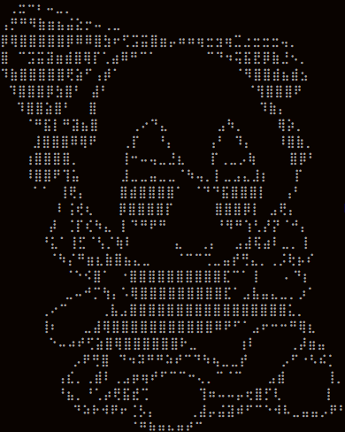

```zsh
> neofetch
```



```csharp
Marj4n@github - FullStack developer (Frontend, Backend, Mobile)
-------------------------
OS: Arch Linux x86_64
Shell: Marjan | Terminal
Pronouns: He/Him
Location: Bogor, West Java, Indonesia
Frameworks: React, Next.js, NestJS, Flutter, SolidJS
Languages: JavaScript, TypeScript, HTML, CSS,
           Kotlin, Python, PHP
Databases: MySQL, PostgreSQL, MongoDB, Firebase
Learning: Data Mining, AI, Docker, Three.js
Hobbies: Gaming, Guitar, Investing
Stars: 42
```

<p align="left">
  
  
  
  
  
</p>
